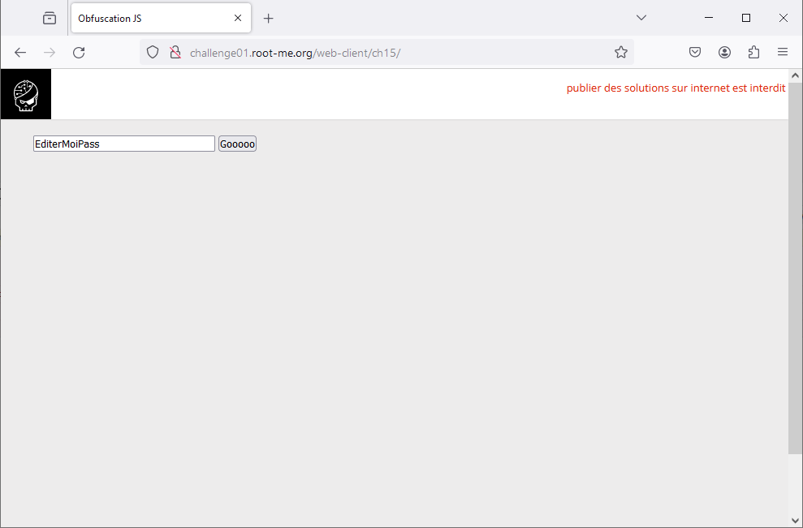
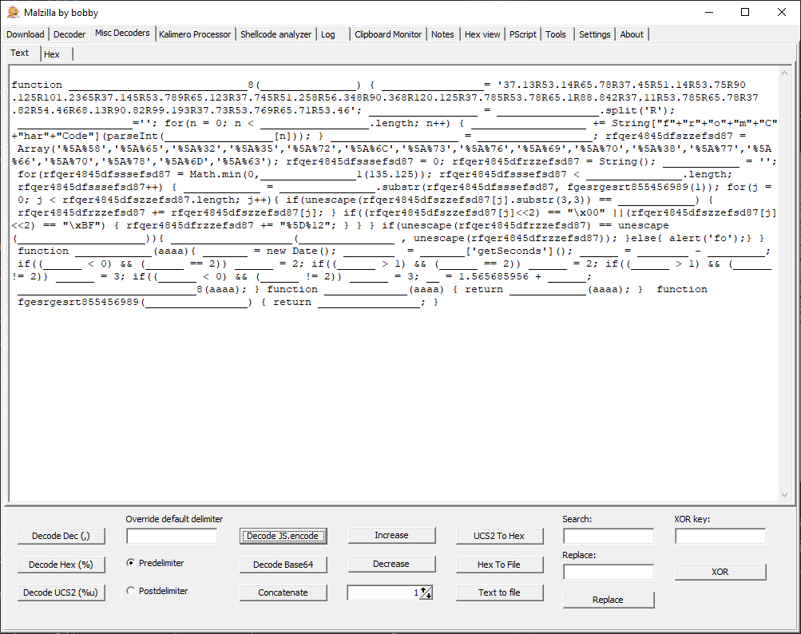

# Projet SERE
#### H4224 : Zijing WENG, Yikang SU, Remy ETIENNE, Le Tuan Khai NGUYEN, Mohamed-Ali LAJNEF
## Javascript - Obfuscation 5 [Web-Clinet][70 Points]
The problem can be found here: https://www.root-me.org/fr/Challenges/Web-Client/Javascript-Obfuscation-5

## First steps
By accessing the challenge page with firefox, we can see a single textbox and a button:


After changing the text and clicking the button, the page redirect to itself with the query `?password=[Text entered]`


Using the build-in developper tools of the browser, we can see that there are multiple errors in the page, and several functions are not defined:


We have to look into the html source code which looks like this:
```html
<html>
<head>
	<title>Obfuscation JS</title>
<!-- 
Obfuscation 
.Niveau : Très Difficile
.By Hel0ck
.The mission : 
	Retrouvez le password :)
	Vous allez en baver HAHAHAHAHHAHHHAHAHHAHAHAHAHHA :x
	
	/!\ ---------------------------------------------------
	INFO !
	Pour que le script marche, vous devez d'abord trouver comment décoder le ttt.js 
	Ce n'est pas trop difficile, faut chercher :D
	------------------------------------------------------- /!\
	
	You need my help ? IRC : irc.root-me.org #root-me
-->
<script type="text/javascript">
    _ = 'function recfn0()......
</script> <script type="text/javascript" src="ttt.js"></script>
</head>
<body><link rel='stylesheet' property='stylesheet' id='s' type='text/css' href='/template/s.css' media='all' /><iframe id='iframe' src='https://www.root-me.org/?page=externe_header'></iframe>
	<form name="login" id="login" action="" method="get" onsubmit="checkPass()">
		<input id="password" name="password"  value="EditerMoiPass" size="30" maxlength="30" />
		<input type="submit" value="Gooooo">
	</form>
</body>
</html>

```
We can see that the html is pretty normal, but the script isn't: it is divided into two parts, the first part is very long and obfuscated(omitted here), the second part is in the file `ttt.js`.  
We also get the hint that we have to first decode `ttt.js`

## Decode ttt.js
Using the URL `http://challenge01.root-me.org/web-client/ch15/ttt.js`, we found out that it is indeed encoded into a character string:


After a lot of research and trial and error, we stumbled upon a encoding method called JScript.Encode : 
https://en.wikipedia.org/wiki/JScript.Encode  
which is reverse engineered : 
http://virtualconspiracy.com/content/articles/breaking-screnc

We used Malzilla tool (available here https://malzilla.org) to decode the script.


Now the 2 parts of javascript can be put together. But still, the script is broken : we got errors when we try to execute it

## Clean up
The script is messed up and we need to beautify the code using https://beautifier.io  
The result: 
```js
_ = 'function recfn0(){ return 0;}';
___ = '';
__ = 0;
eval(_);
for (__________ = 0; __________ < parseInt(100.15786224552145); __________++) {
    n = __________ + 1;
    ___ += 'function recfn' + n + '(){ return recfn' + __________ + '();}';
}
eval(___);
eval(recfn100());
____ = this;
for (_____ in ____) {
    if (_____.length == parseInt(10.125625)) {
        if (_____.charCodeAt(0) == Math.min(115, 12654)) {
            if (_____.charCodeAt(9) == 116) break;
        }
    }
}
var ___________ = new Date();
_________ = ___________['getSeconds']();
____[_____]('_____________("' + login.password.value + '")', ______________(2000));

function ______________(fgseg87857878562) {
    var fgsog87857878562, fgspg87857878562, fgspg87857878561, fgspg87817878562, d, r, fgspg87817878162;
    fgsog87857878562 = fgseg87857878562;
    fgspg87857878562 += fgsog87857878562 >> (fgspg87817878562 - fgsog87857878562);
    fgspg87857878561 -= fgspg87817878562 + fgsog87857878562 + 1337;
    fgspg87817878162 = r ^ fgspg87857878561 + fgsog87857878562;
    return fgsog87857878562;
}

function fgspg87857878561(fgspd87857878561) {
    return fgspd87857878561;
}

function _______________1(PKDFjidfjezif8756265) {
    ________________ = PKDFjidfjezif8756265;
    _________________ = 145;
    if (________________ == 1) {
        return parseInt(1.256);
    }
    if (________________ == 2) {
        return parseInt(2.145);
    }
    if (________________ == 3) {
        return parseInt(3.145);
    }
    if (________________ > 3) {
        ________________ = _________________ + ________________ - _________________;
        return ________________;
    }
    return ________________;
}

function ___________________(______________, _______________) {
    ____________ = '8aZ{E$+rT yU}1#2(IOP<qs,DFg.)H*Jk~L6M7]W;X%VxB:N!^-03/9[4&5|"?Kz';
    _________ = escape(_______________ + ______________ + "eDer");
    output = "";
    var qrfqfqfq844568, qrfqfqfq814568, qsfqfqfq814568 = "";
    var _3, _1, _2, _0 = "";
    ______ = 0;
    _____________ = ____________;
    do {
        qrfqfqfq844568 = _________.charCodeAt(______++);
        qrfqfqfq814568 = _________.charCodeAt(______++);
        qsfqfqfq814568 = _________.charCodeAt(______++);
        _3 = qrfqfqfq844568 >> _______________1(2);
        _1 = ((qrfqfqfq844568 & _______________1(3)) << 4) | (qrfqfqfq814568 >> _______________1(4));
        _2 = ((qrfqfqfq814568 & _______________1(15)) << _______________1(2)) | (qsfqfqfq814568 >> 6);
        _0 = qsfqfqfq814568 & 63;
        if (isNaN(qrfqfqfq814568)) {
            _2 = _0 = 64;
        } else if (isNaN(qsfqfqfq814568)) {
            _0 = 64;
        }
        output = output + _____________.charAt(_3) + ____________.charAt(_1) + _____________.charAt(_2) + ____________.charAt(_0);
        if (arguments.callee.toString().length != 1731) {
            output = "ESF0 ('7p(:5J";
        }
        qrfqfqfq844568 = qrfqfqfq814568 = qsfqfqfq814568 = "";
        _3 = _1 = _2 = _0 = "";
    } while (______ < _________.length);
    if (fgspg87857878561235(output, __) == fgspg87857878561235("}8iH5:}Ypi}*VL}", 13) + fgspg87857878561("^2d2S*,~") + ":" + String["fr" + "om" + "C" + "harCode"](74, 76, 69, 83, 70, 48, 32, 40, 39, 55, 112, 40, 44, 53, 74, 39, 60, 44, 50, 112, 114, 70, 69, 47, 87)) {
        window.location.href = ______________ + ".php";
    } else {
        alert("MOUHAHAHAHHAHAHAHAHA");
    }
}

function fgspg87857878561235(q45qsdfus8465dfsfgth, __) {
    q45qsdfzf8465dfsfgth = "";
    q45qsdfzf8465dfsfguh = "";
    _______________ = 0000000000;
    for (_______________; _______________ < 13 - 2; _______________++) {
        q45qsdfzf8465dfsfgth = q45qsdfus8465dfsfgth.length ^ __;
        if (q45qsdfzf8465dfsfgth != "") q45qsdfzf8465dfsfgth = "";
    }
    q45qsdfzs8465dfsfgth = q45qsdfzf8465dfsfgth;
    q45qsdfzf8465dfsfguh = q45qsdfzs8465dfsfgth;
    for (i = 0; i < q45qsdfus8465dfsfgth.length; i++) {
        if (q45qsdfzs8465dfsfgth == "ESF0 ('7p(,5J')") {
            q45qsdfzs8465dfsfgth += String[unescape("66%72%6f%6d%43%68%61%72%43%6f%64%65")](__ ^ q45qsdfus8465dfsfgth.charCodeAt(i) + 12);
        } else {
            q45qsdfzs8465dfsfgth += String.fromCharCode(__ ^ q45qsdfus8465dfsfgth.charCodeAt(i));
        }
    }
    if (arguments.callee.toString().length != 1169) {
        q45qsdfzs8465dfsfgth = "ESF0 ('7p(:5J";
    }
    if (q45qsdfzf8465dfsfguh == "sfeze5825qsde8rfq--") {
        for (______ = 0; ______ > -1; ______++) {
            q45qsdfzf8465dfsfguh = "\x6e\x6f\x6f\x62\x20\x6e\x6f\x6f\x62";
        }
    }
    return q45qsdfzs8465dfsfgth;
}

function ____________________________8(_______________) {
    ________________ = '37.13R53.14R65.78R37.45R51.14R53.75R90.125R101.2365R37.145R53.789R65.123R37.745R51.258R56.348R90.368R120.125R37.785R53.78R65.1R88.842R37.11R53.785R65.78R37.82R54.46R68.13R90.82R99.193R37.73R53.769R65.71R53.46';
    _________________ = ________________.split('R');
    __________________ = '';
    for (n = 0; n < _________________.length; n++) {
        __________________ += String["f" + "r" + "o" + "m" + "C" + "har" + "Code"](parseInt(_________________[n]));
    }
    ____________________ = __________________;
    rfqer4845dfszzefsd87 = Array('%5A%58', '%5A%65', '%5A%32', '%5A%35', '%5A%72', '%5A%6C', '%5A%73', '%5A%76', '%5A%69', '%5A%70', '%5A%38', '%5A%77', '%5A%66', '%5A%70', '%5A%78', '%5A%6D', '%5A%63');
    rfqer4845dfsssefsd87 = 0;
    rfqer4845dfrzzefsd87 = String();
    ____________ = '';
    for (rfqer4845dfsssefsd87 = Math.min(0, _______________1(135.125)); rfqer4845dfsssefsd87 < _______________.length; rfqer4845dfsssefsd87++) {
        ____________ = _______________.substr(rfqer4845dfsssefsd87, fgesrgesrt855456989(1));
        for (j = 0; j < rfqer4845dfszzefsd87.length; j++) {
            if (unescape(rfqer4845dfszzefsd87[j].substr(3, 3)) == ____________) {
                rfqer4845dfrzzefsd87 += rfqer4845dfszzefsd87[j];
            }
            if ((rfqer4845dfszzefsd87[j] << 2) == "\x00" || (rfqer4845dfszzefsd87[j] << 2) == "\xBF") {
                rfqer4845dfrzzefsd87 += "%5D%12";
            }
        }
    }
    if (unescape(rfqer4845dfrzzefsd87) == unescape(____________________)) {
        ___________________(_______________, unescape(rfqer4845dfrzzefsd87));
    } else {
        alert('fo');
    }
}

function ____________(aaaa) {
    _______ = new Date();
    ________ = _______['getSeconds']();
    ______ = ________ - _________;
    if ((______ < 0) && (______ == 2)) ______ = 2;
    if ((______ > 1) && (______ == 2)) ______ = 2;
    if ((______ > 1) && (______ != 2)) ______ = 3;
    if ((______ < 0) && (______ != 2)) ______ = 3;
    __ = 1.565685956 + ______;
    ____________________________8(aaaa);
}

function _____________(aaaa) {
    return ____________(aaaa);
}

function fgesrgesrt855456989(________________) {
    return ________________;
}
```

We tried online deobfuscaters but they didn't do a lot. So we have to do it by hand :
Rename function and variable names, simplify useless functions like parseInt(constant), remove several useless functions that does return input

## Dissect the code
maybe not useful:
evalstring = '';
function recfn0(){ return 0;}
for (i = 0; i < 100; i++) {
    n = i + 1;
    evalstring += 'function recfn' + n + '(){ return recfn' + i + '();}';
}
eval(evalstring);
eval(recfn100());
make functions recfn0() through recfn100() which all returns 0

This part : 
for (obj in this) {
    if (obj.length == 10) {
        if (obj.charCodeAt(0) == 115) {
            if (obj.charCodeAt(9) == 116) break;
        }
    }
}
just found "setTimeout" object, so func4(login.password.value) is executed 2 seconds after the page is loaded

So delta is always 2 and the globalvar is constant. we can call directly func3

in func3 first part is constant and
array a = {ZX,Ze,Z2,Z5,Zr,Zl,Zs,Zv,Zi,Zp,Z8,Zw,Zf,Zp,Zx,Zm,Zc} if unescaped 
after further inspection, we found out func3 is a check for the password: we iterate through all the character of the password, if it is one of the second character of array a, we put Z+this character to a output string. Then it checks if the output string matches "Z5ZeZ8ZxZXZmZcZ5".
Thus, we can deduce that the password has a non-continuous sub string "5e8xXmc5", and the rest of the password contains no following characters "258Xcefilmprsvwx" (in ASCII order)

After passing func3 we arrive at func1, which is basically a encoder that converts char string into a special base64 code. instead of using normal base64 sequence, it use `8aZ{E$+rT yU}1#2(IOP<qs,DFg.)H*Jk~L6M7]W;X%VxB:N!^-03/9[4&5|"?Kz` as its character table.
However, if (arguments.callee.toString().length != 1731), which means if the whole function declaration isn't the correct size, the output resets to a specific each time. The original size of the obfuscated function is 1477, which is strange. Some post mentioned that Firefox might optimize the code before calling function.toString(), but it wasn't the case here because we verified it on the old Internet Explorer. 
We still have hope because actually the overriding string is found in later comparison, so maybe it is intended.

Moving on to func2. The second param is used only in bitwize xor, with the value of 11 or 1101 in binary.The escaped string is evidently "fromCharCode", but it missed a "%". After deleting useless parts of the code, it is clear that it take all the characters of the first argument and xor it with the second argument. Except if we stumped upon "ESF0 ('7p(,5J')" we have to change a little bit. However, everything seemed to be quite useless, as it checks the length of the function as well, and all it does now is to return the same weird sting. 

Finally, if all the tests are passed, the script will redirect the page to (password).php. We have to guess that it will give us the final flag to capture, the answer of the problem. Now the whole program make more sense: the steps to check length of function might be broken during the obfuscation process, and the whole javascript code isn't meant to be executed on the web page; instead, we just need to find out a password that checks all the tests, and go directly to the php page. We can thus ignore those function length checks. 

We start working backwards:
We have to have func2(string, globalvar) == func2("}8iH5:}Ypi}*VL}", 13) + "^2d2S*,~:JLESF0 ('7p(,5J'<,2prFE/W"
which means func2(string, 3) == "p5rdEr87pT}dp'[Ap^2d2S*,~:JLESF0 ('7p(,5J'<,2prFE/W"
And since xor is reversable by simply doing another xor, we guess the string is func2("p5rdEr87pT}dp'[Ap^2d2S*,~:JLESF0 ('7p(,5J'<,2prFE/W", 3) which gave us "s6qgFq;4sW~gs$XBs]1g1P)/}9IOFPE3#+$4s+/6I$?/1sqEF,T". 

Then we need to decode it back to char string. Writing a decoder similar to the encoder does the trick, the result :
"Z5ZeZ8ZxZXZmZcZ5753dRe148axXmcD_u5eDer�"
The last character is just a special case and ignored. We immediately recognized the pattern, by truncating the head and tail, this is what is left: "753dRe148axXmcD_u5" and this string checks the first test!

Visiting http://challenge01.root-me.org/web-client/ch15/753dRe148axXmcD_u5.php gave us a blank page, but it also mean that the file is there and it's not a 404. Hence, 753dRe148axXmcD_u5 must be the password and we captured the flag!